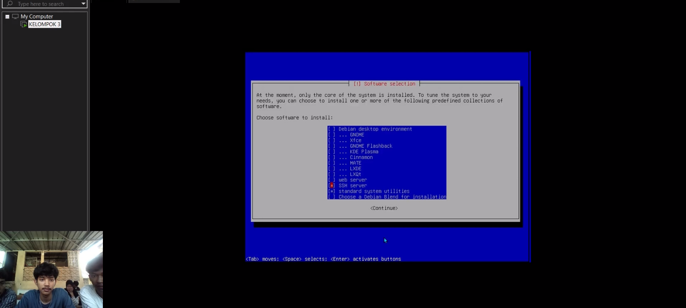
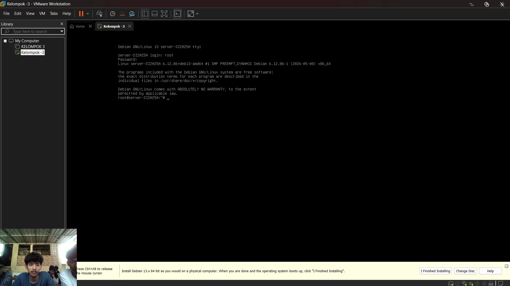
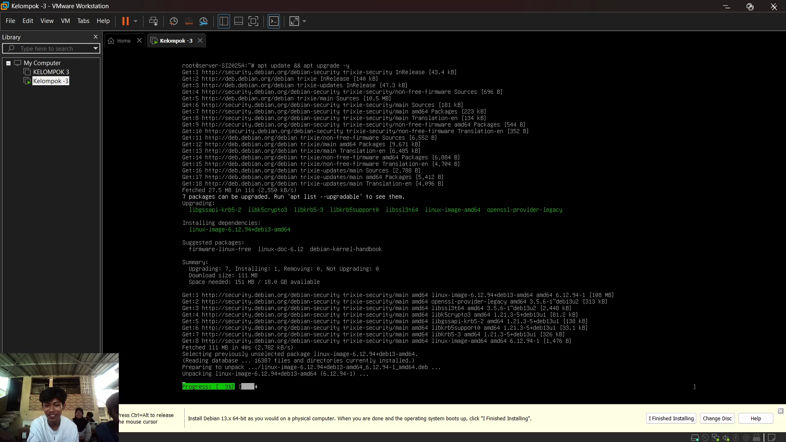
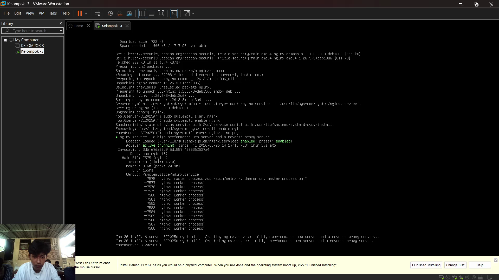
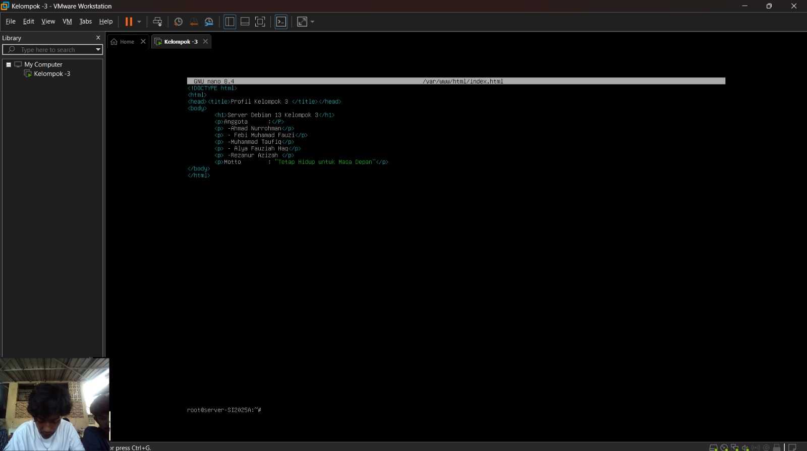
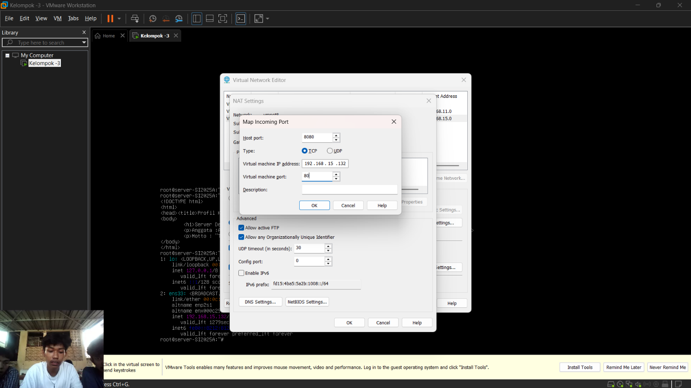
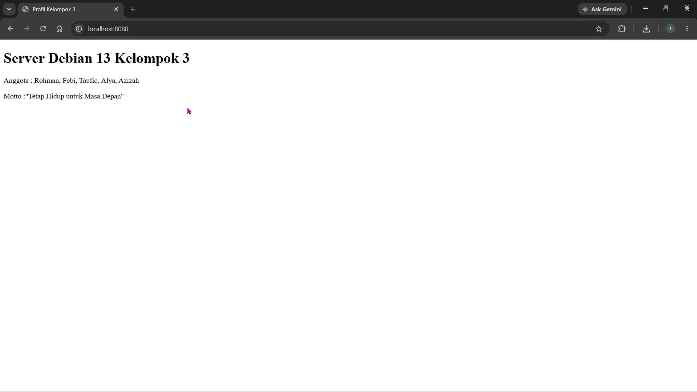

# sistem-operasi-si25A-kelompok3
# Tugas Instalasi Debian 13 Headless - Kelompok 3
# Laporan Tugas Kelompok: Instalasi Debian 13 Headless Web Server
Mata Kuliah: Sistem Operasi (SI-25)
Program Studi: Sistem Informasi, Universitas Galuh

## 👥 Anggota Kelompok 3 (Kelas SI-2025A)
1. Ahmad Nurrohman - 7020250017
2. Febi Muhammad Fauzi - 7020250005
3. Muhammad Taufiq - 7020250009
4. Rezanur Azizah - 7020250003
5. Alya Fauziah Haq - 7020250002

## 🎯 Spesifikasi Lingkungan Server
* **Hypervisor:** VMware Workstation Pro
* **Sistem Operasi:** Debian 13 (Bookworm) - Headless (CLI / Tanpa GUI)
* **IP Address VM (Guest):** `192.168.15.131` (Gunakan perintah `ip a` pada antarmuka ens33 untuk melihat IP VM Anda)
* **Port Forwarding:** Host Port `8080` -> VM Port `80` (HTTP)

## 🛠️ Langkah-Langkah & Dokumentasi Praktikum

### 1. Instalasi Debian 13 Headless
* Melakukan instalasi sistem operasi Debian 13 mode teks dengan partisi guided (single partition).
* Mengatur hostname: `server-SI2025A` dan memasang bootloader GRUB ke `/dev/sda`.
* Memastikan hanya mencentang **SSH Server** dan **standard system utilities** pada tahap Software Selection.
* Screenshot proses menu software selection di bawah ini
  

* Screenshot tampilan login terminal Debian pertama kali di bawah ini
  

### 2. Konfigurasi User Sudo & Update Repositori
* Masuk sebagai user `root`, menginstal paket `sudo`, dan menambahkan user biasa ke grup sudo.
* Menjalankan pembaruan paket sistem dengan perintah:
  ```bash
  apt update && apt upgrade -y
  apt install sudo -y
  usermod -aG sudo [nama-user-kelompok]
  reboot
  ```
* *Screenshot hasil uji coba perintah sudo oleh user biasa di bawah ini*
   *(Catatan: sesuaikan nama file dengan screenshot Anda)*

### 3. Instalasi Web Server Nginx & Tools Dasar
* Menginstal `net-tools`, `curl`, `git`, dan `nginx` menggunakan command line.
* Menjalankan dan mengaktifkan service Nginx agar berjalan otomatis saat booting.
  ```bash
  sudo apt install net-tools curl git nginx -y
  sudo systemctl start nginx
  sudo systemctl enable nginx
  ```
* *Screenshot status active running dari Nginx*
  

### 4. Pembuatan Halaman Web Profil Kelompok
* Mengubah dokumen default Nginx pada `/var/www/html/index.html` dengan HTML profil anggota kelompok Anda.
* Melakukan restart web server untuk memuat perubahan.
  ```bash
  sudo systemctl restart nginx
  ```
* *Screenshot pengeditan index.html menggunakan nano editor*
  

### 5. Konfigurasi Port Forwarding VMware & Pengujian Host
* Melakukan pemetaan port 8080 pada Windows Host ke port 80 Debian Guest VM lewat menu Virtual Network Editor.
* Menguji akses web server Debian melalui browser di sistem operasi host.
* *Screenshot pengaturan NAT Settings VMware*
  
  
* *Screenshot halaman profil kelompok yang berhasil diakses dari browser host di http://localhost:8080*
  

## 🎥 Link Video Demo
Tonton Video Demo Pengerjaan Tugas Kelompok 3 di YouTube / Google Drive
(https://youtube.com/...)  
(https://drive.google.com/drive/folders/1N328_OH-5UdNnGg3x8OQ_pglddKVPWPA)

## 📝 Kesimpulan
Tuliskan simpulan dari praktikum yang telah dilakukan serta poin-poin penting yang didapatkan selama melakukan setup server Linux headless.
